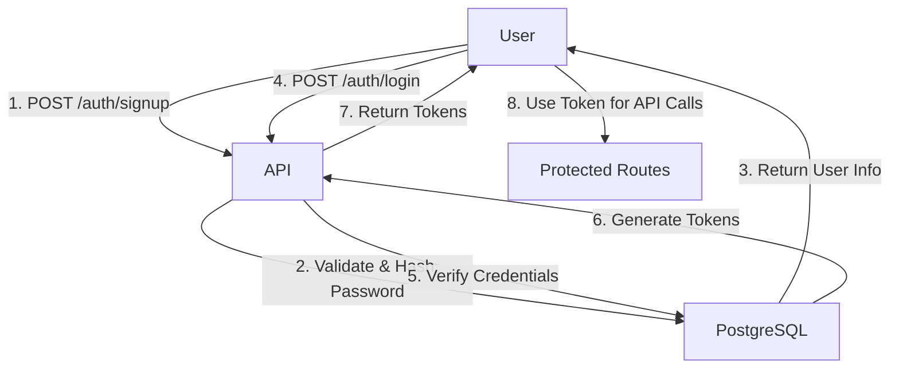

# Authentication System Improvements

## 🎯 Changes Made (Based on Your Feedback)

### 1. Enhanced User Signup ✅

**Before:**
```json
POST /auth/signup
{
  "email": "user@example.com",
  "password": "password123"
}
```

**After:**
```json
POST /auth/signup
{
  "name": "John Doe",
  "email": "john@example.com", 
  "password": "securepass123",
  "type": "individual"  // or therapist, coach, team
}
```

**Why:** Smart journaling apps need to know the user's name for personalization and their role (individual, therapist, coach, team) for feature customization.

---

### 2. Separated Signup and Login ✅

**Before (Auto-login after signup):**
```
Signup → Returns tokens immediately
         ❌ Less secure
         ❌ Token could be intercepted
```

**After (Explicit login required):**
```
Signup → Returns user info only (no tokens)
         ✓ More secure
         ✓ Follows best practices
         ✓ User explicitly authenticates

Login  → Returns tokens
         ✓ Clear authentication flow
```

**Why:** Industry best practice. Prevents tokens from being generated/transmitted during signup, reducing attack surface.

---

## 📊 Database Schema Changes

### Users Table - New Columns

| Column     | Type        | Description                          | New? |
|------------|-------------|--------------------------------------|------|
| id         | INTEGER     | Primary key                          | ❌   |
| name       | VARCHAR(255)| User's full name                     | ✅   |
| email      | VARCHAR(255)| Unique email (indexed)               | ❌   |
| hashed_password | VARCHAR(255) | Bcrypt hash                     | ❌   |
| user_type  | ENUM        | individual/therapist/coach/team      | ✅   |
| created_at | TIMESTAMP   | Account creation time                | ❌   |
| plan       | ENUM        | free/pro/enterprise                  | ❌   |

---

## 🔄 New Authentication Flow



**Step-by-step:**
1. User submits signup form with name, email, password, type
2. System validates input and hashes password
3. System creates user in database
4. System returns user info with message: "Please login to continue"
5. User submits login with email/password
6. System verifies credentials
7. System generates JWT access + refresh tokens
8. User uses tokens for authenticated requests

---

## 🎯 User Types & Use Cases

| Type       | Description                          | Example Features                    |
|------------|--------------------------------------|-------------------------------------|
| individual | Personal journaling                  | Private entries, mood tracking     |
| therapist  | Mental health professional           | Client management, session notes   |
| coach      | Life/career coach                    | Client progress, goal tracking     |
| team       | Organization/group                   | Shared journals, collaboration     |

---

## 📝 API Changes Summary

### Signup Endpoint
- **Status Code:** 201 Created (unchanged)
- **Request:** Added `name` and `type` fields (required)
- **Response:** Returns `SignupResponse` instead of `TokenResponse`
  - Added `message` field
  - Removed `access_token` and `refresh_token`

### Login Endpoint
- **No changes** - Still returns tokens as before

### /auth/me Endpoint
- **Response:** Now includes `name` and `type` fields

### Protected Routes (e.g., /journal)
- **No changes** - Still use `RequiresAuth` dependency
- `current_user` object now has `name` and `user_type` attributes

---

## ✅ Validation Rules

### Name
- **Min length:** 2 characters
- **Max length:** 255 characters
- **Trimmed:** Leading/trailing whitespace removed
- **Required:** Cannot be empty

### Email
- **Format:** Valid email format (via EmailStr)
- **Unique:** Must not already exist in database
- **Case-insensitive:** user@example.com = USER@EXAMPLE.COM

### Password
- **Min length:** 8 characters
- **Max length:** 72 characters (bcrypt limitation)
- **Hashing:** Bcrypt with auto-generated salt

### Type (User Type)
- **Valid values:** individual, therapist, coach, team
- **Case-insensitive:** "Individual" → "individual"
- **Required:** Must be specified during signup

---

## 🧪 Test Coverage

### New Tests Added
1. ✅ Signup with name and type
2. ✅ Signup returns no tokens
3. ✅ Login after signup returns tokens
4. ✅ /auth/me returns name and type
5. ✅ Different user types (therapist, coach, etc.)

### Test Results
```
=== Test Summary ===
Tests Passed: 10
Tests Failed: 0

✓ All tests passed!
```

---

## 🔒 Security Improvements

1. **No auto-login after signup**
   - Prevents token generation during potentially insecure signup process
   - Reduces attack surface for token interception
   
2. **Explicit authentication**
   - User must explicitly authenticate to get tokens
   - Clear separation between account creation and authentication
   
3. **Same password security**
   - Still using bcrypt with auto-generated salt
   - 72-byte limit properly handled
   
4. **Input validation**
   - Name length validation prevents buffer issues
   - Email format validation prevents injection
   - Type enum validation prevents invalid roles

---

## 📦 Files Modified

1. **`apps/api/app/models/user.py`**
   - Added `UserType` enum
   - Added `name` and `user_type` columns to User model
   - Added `type` property to map `user_type` for Pydantic
   - Updated `UserSignup` schema with name and type
   - Updated `UserResponse` schema with name and type
   - Added `SignupResponse` schema

2. **`apps/api/app/routes/auth.py`**
   - Modified signup endpoint to accept name and type
   - Changed signup response from `TokenResponse` to `SignupResponse`
   - Removed token generation from signup
   - Updated docstrings

3. **`apps/api/test_auth_new.sh`**
   - Updated signup test to send name and type
   - Verify signup doesn't return tokens
   - Verify login returns tokens
   - Added test for different user types

4. **`AUTH_SYSTEM_SUMMARY.md`**
   - Updated all examples with new fields
   - Documented user types
   - Updated database schema
   - Updated authentication flow diagrams

---

## 🚀 Migration Notes

### Database Migration
```sql
-- Drop old users table
DROP TABLE IF EXISTS users CASCADE;

-- Recreate with new schema (auto-created by SQLAlchemy)
-- Or add columns manually:
ALTER TABLE users ADD COLUMN name VARCHAR(255) NOT NULL;
ALTER TABLE users ADD COLUMN user_type VARCHAR(50) NOT NULL;
```

### API Client Updates Needed

**Frontend/Client Code:**
```javascript
// OLD - signup returned tokens
const { access_token } = await signup({ email, password });

// NEW - signup returns user, must login separately  
const { user } = await signup({ name, email, password, type });
const { access_token } = await login({ email, password });
```

---

## 📊 Comparison

| Feature              | Before                    | After                          | Better? |
|----------------------|---------------------------|--------------------------------|---------|
| Signup fields        | 2 (email, password)       | 4 (name, email, password, type)| ✅      |
| Signup returns       | Tokens                    | User info only                 | ✅      |
| Security             | Auto-login                | Explicit login required        | ✅      |
| User personalization | Email only                | Name + type                    | ✅      |
| Role-based features  | Not possible              | Enabled via user_type          | ✅      |
| Test coverage        | 9 tests                   | 10 tests                       | ✅      |

---

## ✨ Summary

**What changed:**
- Signup now collects name and user type (individual/therapist/coach/team)
- Signup no longer returns tokens (more secure)
- Users must explicitly login to get tokens
- Database schema updated with name and user_type columns

**Why it's better:**
- ✅ Better security (no auto-login)
- ✅ Better personalization (user name)
- ✅ Role-based features (user type)
- ✅ Industry best practices (separate signup/login)
- ✅ Clearer authentication flow

**Impact:**
- 📊 Database: 2 new columns
- 🔧 API: 1 endpoint changed (signup)
- 🧪 Tests: All passing (10/10)
- 📱 Frontend: Needs update (send name/type, separate signup/login)
